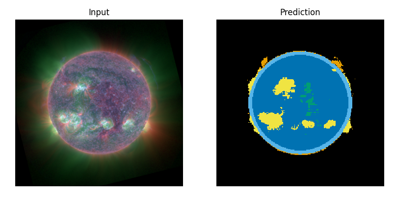

# cordmap
⚠️CAUTION: this repo is still under heavy development⚠️

Tools for **CO**mprehensive **R**apid **D**igest maps for space weather.

Above is an example input and output from the fine-tuned Segment Anything Model. 
This is a preliminary result which will be improved. 

## 1. Preparing data

1. Run `bin/download_data.py` to download the data. 
2. Run `bin/prepare_data.py` to clean the data and prepare Zarr archives

## 2. Train
Run `bin/train.py`

## 3. Evaluate
Run `bin/evaluate.py`

## Contact
This is a work in progress. For more information, contact Marcus Hughes at `marcus.hughes@swri.org`. 
